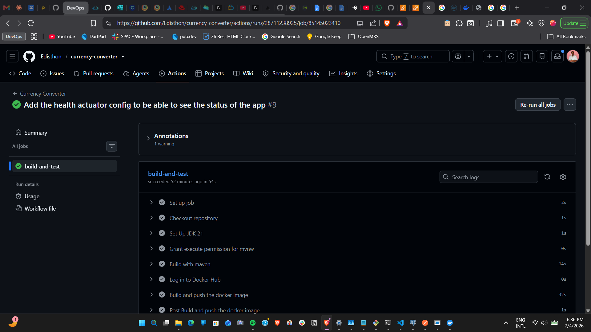
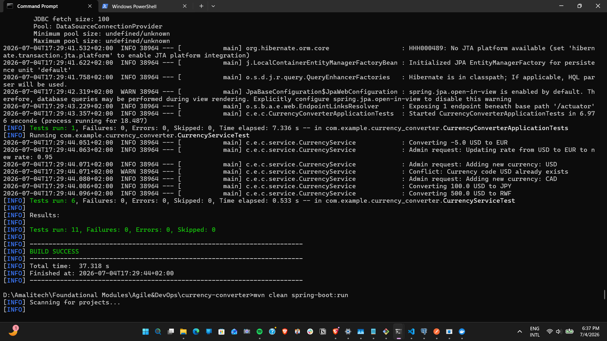
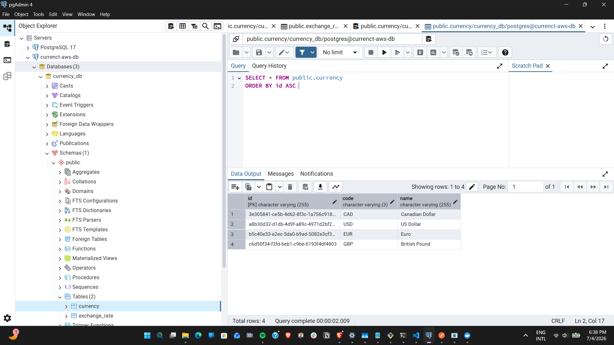
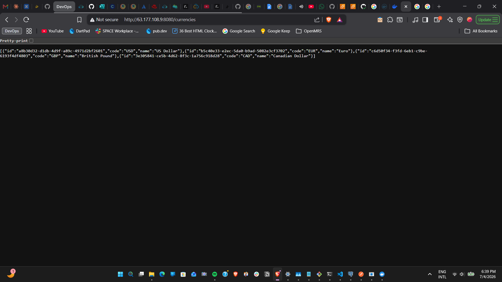
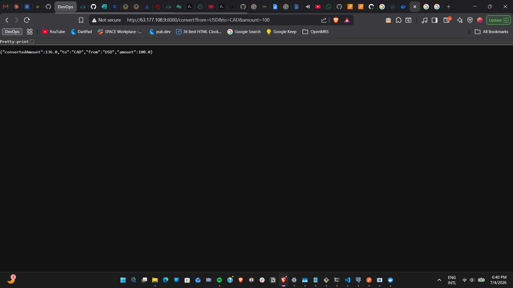
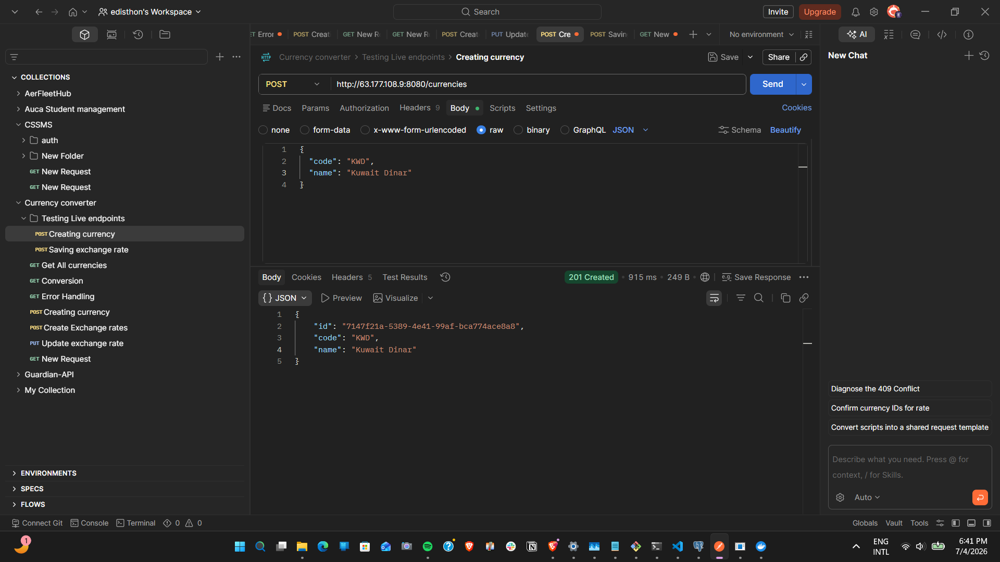
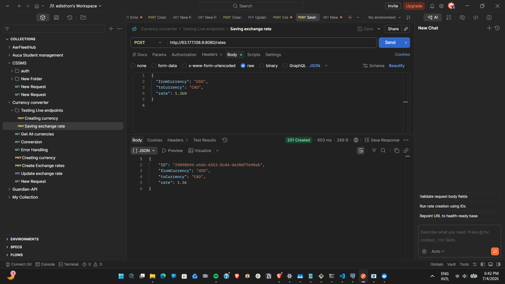
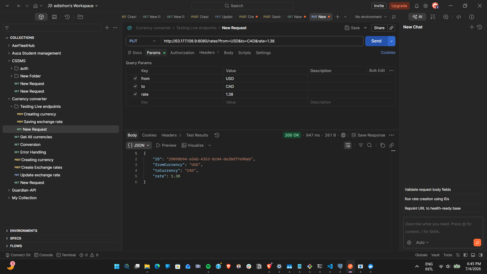
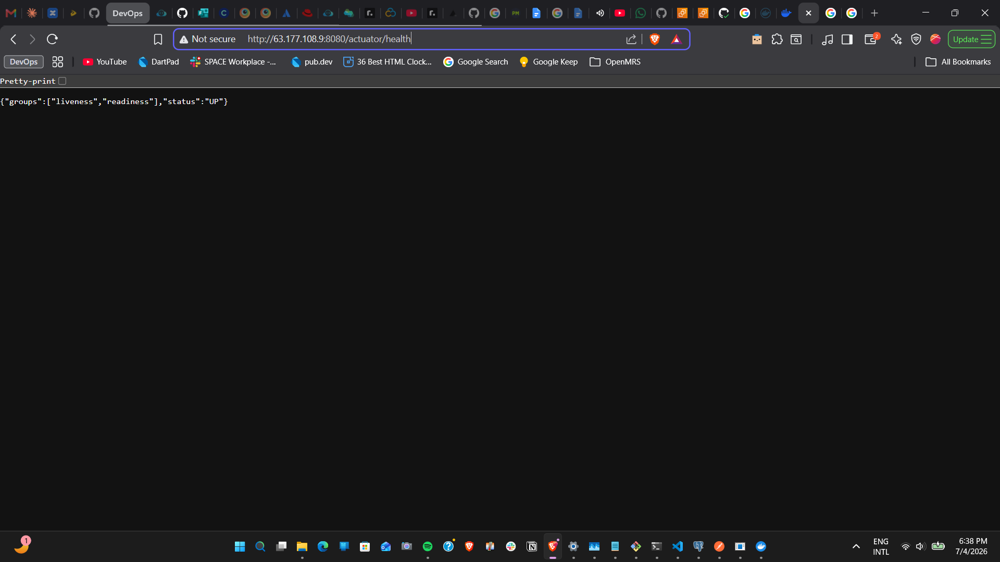
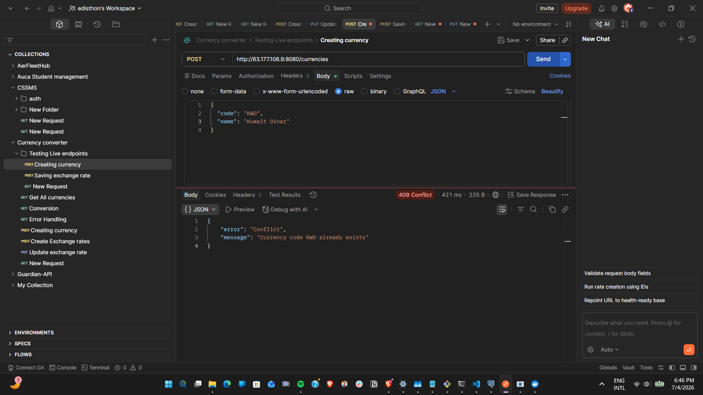

# Currency Converter REST API (Agile & DevOps Assignment)

A production-ready, containerized Java Spring Boot REST API for currency conversions, built using **Scrum (Agile) project ceremonies** and a **Continuous Integration & Continuous Delivery (CI/CD)** pipeline.

---

## Live Demo URL
* **API base URL**: `http://63.177.108.9:8080`
* **Health Check**: `http://63.177.108.9:8080/actuator/health` (Returns `{"status": "UP"}`)
* **Supported Currencies**: `http://63.177.108.9:8080/currencies`

---

## Repository Deliverables Mapping
To make it easy for evaluators to review this project, here is how the course requirements map to this repository:
1. **Backlog & Sprint Plans**: Tracked in [SCRUM_DOCUMENT.md](SCRUM_DOCUMENT.md).
2. **Codebase**: Spring Boot REST API code under [src/main/java/com/example/currency_converter](src/main/java/com/example/currency_converter).
3. **CI/CD Evidence**: GitHub Actions workflow file in [.github/workflows/deploy.yaml](.github/workflows/deploy.yaml).
4. **Testing Evidence**: Service and Integration tests under [src/test/java/com/example/currency_converter](src/test/java/com/example/currency_converter).

### Tech Stack
* **Java 21** & **Spring Boot 3.x** (Web, JPA, Actuator, Validation)
* **PostgreSQL** (Production/Cloud database)
* **H2 Database** (Isolated in-memory test database)
* **Docker & Docker Compose** (Containerization platform)
* **GitHub Actions** (CI/CD pipeline orchestrator)
* **AWS EC2 & AWS RDS** (Cloud deployment infrastructure)


---

## Sprint 0: Backlog Planning & Estimates

During the initial planning stage, we defined our backlog, estimated stories using **Story Points, and aligned on the **Definition of Done (DoD)**.

### Product Backlog
Our Product Backlog consists of 7 User Stories (estimated based on complexity and risk):
* **US-01**: Currency Conversion API (2 SP - High)
* **US-02**: Fetch Supported Currencies API (2 SP - High)
* **US-03**: Add Currency & Exchange Rate (3 SP - High)
* **US-04**: Update Exchange Rate (2 SP - Medium)
* **US-05**: Create JUnit Test Suite (5 SP - High)
* **US-06**: Set up CI Pipeline (5 SP - High)
* **US-07**: Basic Health Monitoring & Logging (3 SP - High)

### Definition of Done (DoD)
Before any user story can be considered "Done" and ready for staging/production, it must satisfy:
1. Code compiles with zero errors and warnings
2. All endpoints and functionalities are working and  have Unit tests
3. Invalid inputs are dones using assertions
4. ode is pushed automatically to the repo and the Github actions pipeline is triggered automatically
5. Maven build passes 
6. Health status returned is OK and UP

---

## Sprint 1: Development & Continuous Integration

Sprint 1 focused on building the core conversion logic, exposing the client-facing APIs, and establishing automated testing and CI pipelines.

### 1. Bootstrapping the Project
* Initialized the application using Spring Initializr (dependencies: Spring Web, Spring Data JPA, PostgreSQL Driver, H2 Database, Lombok, Spring Boot Actuator).
* Set up a clean directory structure separating JPA Models, Repositories, Services, and REST Controllers.

### 2. Dual Database Environment (Isolating Tests)
A critical DevOps practice is isolating test executions from production data. We configured a dual-profile configuration:
* **Local/Cloud Execution**: [application.properties](src/main/resources/application.properties) is configured to connect to PostgreSQL (`currency_db`).
* **Test Isolation**: Created a separate [application.properties](src/test/resources/application.properties) inside test resources. This forces all JUnit runs to build and execute against a lightweight, in-memory **H2 Database**, keeping local and cloud builds independent of database server availability.

### 3. API Core Implementation
We delivered the client conversion endpoints under `CurrencyController.java`:
* **`GET /currencies`**: Queries `CurrencyRepository` and returns supported currencies.
* **`GET /convert`**: Queries `ExchangeRateRepository` to find the conversion rate. The service multiplies the amount by the exchange rate and rounds it to exactly **3 decimal places** using Java's `BigDecimal.setScale(3, RoundingMode.HALF_UP)`.
* **Validation**: Centralized input checks return a custom error payload if the conversion amount is less than or equal to zero.

### 4. Automated Testing (JUnit 5 & MockMvc)
* **Unit Tests (`CurrencyServiceTest.java`)**: Tests the arithmetic correctness of conversion math and verifies validation exceptions.
* **Integration Tests (`CurrencyControllerTest.java`)**: Employs Spring's `MockMvc` to perform virtual HTTP queries. We mock repository responses and assert returned HTTP status codes (200 OK, 400 Bad Request) and JSON body payloads.

### 5. Continuous Integration (GitHub Actions)
To ensure no code breaks on integration, we created a GitHub Actions workflow in `.github/workflows/deploy.yaml`. 
* **Triggers**: Triggers automatically on pushes to `dev`, `staging`, and `main` branches, and on pull requests to `staging` and `main`.
* **Flow**: Starts a clean Ubuntu runner, configures JDK 21, installs Maven, grants permissions to `mvnw`, and executes `./mvnw clean test`.
* **CI Evidence**: The workflow runs automatically and displays a green checkmark in GitHub when all 6 integration and unit tests pass.

---

## Containerization & Cloud Infrastructure (Continuous Delivery)

To complete the **Release & Deploy (CD)** stages of our pipeline, we containerized the application and deployed it to the cloud.

### 1. Dockerization
To standardize the build and execution environment:
* **Multi-stage Dockerfile**: Separates compilation and packaging from the final runtime execution.
  * **Stage 1 (Build)**: Compiles the JAR using `maven:3.9.6-eclipse-temurin-21-alpine`.
  * **Stage 2 (Runtime)**: Runs the JAR on a lightweight `eclipse-temurin:21-jre-alpine` runtime. This keeps the final image small and secure.
* **Docker Compose**: Created a [docker-compose.yml](docker-compose.yml) file to spin up both the Spring Boot app and a PostgreSQL database locally with a single command (`docker-compose up --build`).

### 2. Automating Image Release to Docker Hub
We updated the GitHub Actions workflow to publish the final container image on every successful build:
* Configured encrypted **GitHub Secrets** for Docker Hub credentials (`DOCKERHUB_USERNAME`, `DOCKERHUB_TOKEN`).
* Added steps to log in to Docker Hub and push the built image tagged with `:latest` and the unique `github.sha` commit code.
* **CD Release Evidence**: Images build and push automatically, showing up live on Docker Hub.

### 3. Cloud Database Provisioning (AWS RDS)
* Created an **AWS RDS PostgreSQL** database (`currency-db`) using the **Free Tier** configuration to prevent costs.
* Set **Public Access** to **Yes** so the app server and pgAdmin could reach it.
* Modified the **RDS Security Group** to accept incoming PostgreSQL traffic (Port `5432`) from Anywhere (`0.0.0.0/0`).
* Configured an initial database named `currency_db` so the SQL schema was auto-created.

### 4. Cloud Server Deployment (AWS EC2)
* Launched a free-tier **AWS EC2 virtual instance** running Amazon Linux 2023.
* Configured the **EC2 Security Group** to open inbound ports:
  * Port `22` (SSH) to allow secure server configuration.
  * Port `8080` (HTTP) to allow access to the Spring Boot REST API.
* Connected via SSH, installed the Docker engine, started the docker daemon, and added the user to the docker permissions group.
* Ran the container in detached mode, exposing port `8080` and injecting cloud database credentials via runtime environment variables:
  ```bash
  docker run -d -p 8080:8080 \
    -e SPRING_DATASOURCE_URL=jdbc:postgresql://<RDS_ENDPOINT>:5432/currency_db \
    -e SPRING_DATASOURCE_USERNAME=postgres \
    -e SPRING_DATASOURCE_PASSWORD=<PASSWORD> \
    --name currency-app \
    --restart always \
    edisthon/currency-converter:latest

---

## Sprint 2: Administrative Features, Logging & Monitoring

Sprint 2 focused on security boundaries (Admin APIs), operational logging, and server monitoring to ensure robust system management.

### 1. Administrative Endpoints
We exposed admin APIs in `CurrencyController.java` to dynamically manipulate currencies and rates in the cloud without needing direct database access:
* **`POST /currencies`**: Registers a new currency.
* **`POST /rates`**: Registers a new conversion rate.
* **`PUT /rates`**: Updates an existing conversion rate.

### 2. Centralized Error & Conflict Handling
We added a custom exception mapping to handle input constraints and conflicts gracefully:
* **Conflict (HTTP 409)**: Trying to add a currency or rate pair that already exists throws an `IllegalStateException` which returns a clean JSON error response.
* **Bad Request (HTTP 400)**: Sending invalid inputs (e.g., negative conversion amounts, negative update rates) returns a validation error response.

### 3. Basic Monitoring & Logging (US-07)
* **Health Check**: Exposed Spring Boot Actuator `/actuator/health` to allow automated health monitoring of the Spring context and the PostgreSQL database.
* **Operational Logging**: Implemented SLF4J loggers (via Lombok `@Slf4j`) to write request parameters, warnings, validation failures, and admin operations to the container console.

### 4. Running the Tests
We wrote 5 additional unit and integration tests (bringing the total to 11 tests) verifying all POST, PUT, and health behaviors. 
* Execute locally:
  ```bash
  .\mvnw clean test
  ```
* All 11 tests pass successfully (`BUILD SUCCESS`).

---

## Endpoint Reference Sheet

Here are all the live REST endpoints exposed by the application:

| Method | Endpoint | Description | Request Body / Query Params | Expected Status |
| :--- | :--- | :--- | :--- | :---: |
| **GET** | `/currencies` | Retrieve all supported currencies | None | 200 OK |
| **GET** | `/convert` | Convert amount between two currencies | `?from=USD&to=EUR&amount=100` | 200 OK |
| **POST** | `/currencies` | Add a new currency (Admin) | JSON body with `code` and `name` | 201 Created |
| **POST** | `/rates` | Add a new exchange rate (Admin) | JSON body with `from`, `to`, and `rate` | 201 Created |
| **PUT** | `/rates` | Update an existing rate (Admin) | `?from=USD&to=EUR&rate=0.95` | 200 OK |
| **GET** | `/actuator/health` | Check application & DB health | None | 200 OK |

---

## Project Evidence & Deliverables Screenshots

Below is the verified visual evidence matching the course deliverables:

### 1. CI/CD Pipeline Build Evidence (Deliverable 3)
The GitHub Actions workflow compiles the code, resolves dependencies, and executes the entire 11-test suite upon every push.
* **Pipeline Status**: Successful (Green Indicator)



---

### 2. Automated Test Results (Deliverable 4)
The test suite consists of 11 passing Unit & Integration tests covering all business operations, rounding math, validation checks, and error controllers.
* **Maven Test Output**: `BUILD SUCCESS` (11 tests run, 0 failures, 0 errors)



---

### 3. pgAdmin Cloud Database Connection (Deliverable 3 & 4)
The AWS RDS PostgreSQL server running at `currency-db.cix6aaiema5t.us-east-1.rds.amazonaws.com` successfully holds the `currency` and `exchange_rate` tables populated with default conversion records.



---

### 4. Postman API End-to-End Testing (Deliverable 5)
Manual Postman executions against the live AWS EC2 server (`http://63.177.108.9:8080`) verified:

#### A. Fetch Supported Currencies (`GET /currencies`)


---

#### B. Currency Conversion Logic (`GET /convert`)


---

#### C. Create New Currency (`POST /currencies`)


---

#### D. Create New Exchange Rate (`POST /rates`)


---

#### E. Update Exchange Rate (`PUT /rates`)


---

#### F. Actuator Health Monitoring (`GET /actuator/health` - US-07)


---

#### G. Exception Handling & Error Validation (`409 Conflict` Duplicates Check)

